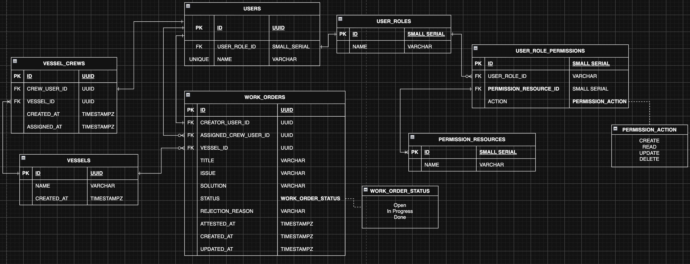

# Kapitan Kiddo
- an app for kapitanos y kapitanas!

A marine work order management system: Admins register vessels and enlist members, Captains log work orders for the crew under their command, and Crew work the orders through to the Captain's attestation.

Built with Next.js (App Router), TypeScript, Tailwind CSS, and Supabase.

## Entity Relationship Diagram

### Relationships

- **users -> user_roles** every user has exactly one role (`Admin`, `Captain`, or `Crew`).
- **user_role_permissions -> user_roles / permission_resources** RBAC grants: which role may perform which `permission_action` (`create`, `read`, `update`, `delete`) on which resource.
- **vessel_crews -> users / vessels** vessel membership linking captains and crew to the vessel they serve on; one row per member per vessel (unique pair).
- **work_orders -> users (creator)** the Captain who logged the order.
- **work_orders -> users (assigned crew)** the Crew member responsible for it.
- **work_orders -> vessels** the vessel the order applies to.
- **work_orders.status -> work_order_status** enum strictly `Open` -> `In Progress` -> `Done`; a `Done` order is then either attested (`attested_at` set, final) or rejected (`rejection_reason` set, returned to `In Progress`).

### RBAC detail

A closer view of the role/permission subsystem:

